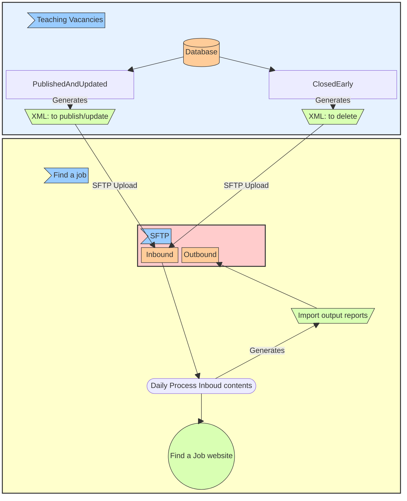
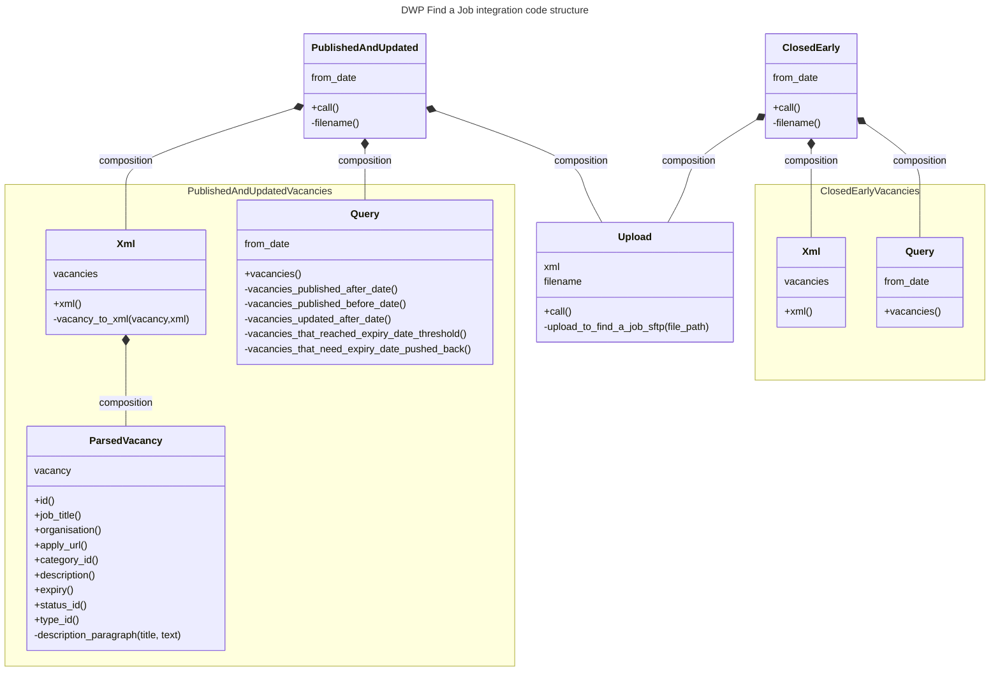
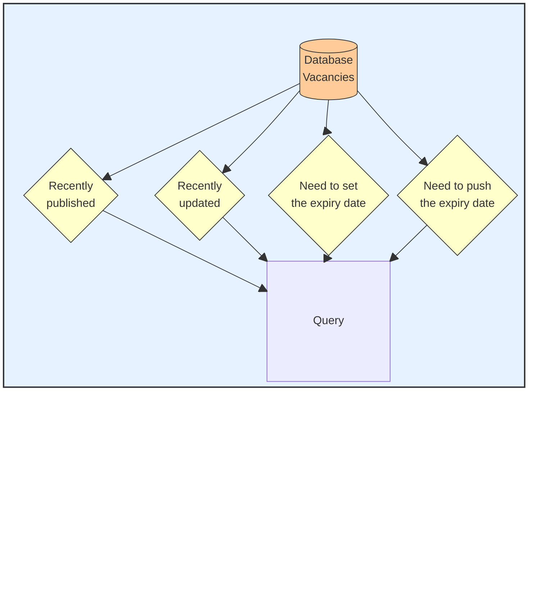

# Integration with DWP "Find a job" service

We publish our published internal vacancies to the Department of Work and Pensions [Find a job service](https://findajob.dwp.gov.uk/).

## Overview of the integration
Find a job service integration is done through daily XML bulk uploads to their SFTP server.

There are 2 bulk upload types:

1. Uploading new/edited vacancies (published/updated on TV vacancies)
2. Uploading expired/deleted vacancies (manually closed early on TV vacancies)

The bulk upload file/s are imported once per day by Find a job service.

Teaching Vacancies has no control on the frequency or timing of these imports, besides pushing info daily to be imported by Find a job.

## Process overview
The process has 3 stages:
1. Query to filter the vacancies that need to be published/updated or deleted in Find a Job.
2. Generate a bulk XML temporal file from those vacancies following Find a Job file specs.
3. Push the file to the Find a Job service SFTP server.

## Uploading published/updated vacancies

The service orcherstating the upload of new/edited vacancies is [Vacancies::Export::DwpFindAJob::PublishedAndUpdated](../../app/services/vacancies/export/dwp_find_a_job/published_and_updated.rb)

### What vacancies are exported?
We publish vacancies that fall on any of these conditions:
- Got published on/after the given date.
  EG: Providing yesterday's date, all the vacancies published yesterday and today will be returned.
- Were previously published but got updated after the given date.
  In this case, the publish will update the vacancy changed info in the Find a Job service.
- Were previously published but need their expiry date to be updated/pushed back in Find a Job service.

### Vacancies that need their expiry date updated/pushed back

Find a Job service has a limit on the vacancy closing/expiry date:

**A vacancy advert must expire in maximum of 30 days from the date it got published/updated .**

For a vacancy to be accepted we must either:
- Do not specify an expiry date in its XML value: It will default to 30 days.
- Set a specific expiry date in its XML value: Between 1 and 30 days after the publish/update date.

#### The problem with this limitation
The majority of our live vacancies have closing dates way beyond a month from the publish date.

**How do we ensure the vacancy from TV is live in the DWP Find a Job service after 30 days from being published?**

#### Our take on resolving this
Forcing regular updates to Find a Job for TV long-life vacancies, pushing back the expiry date to 30 days from the update.

Doing this daily would cause hundreds/thousands of unneeded updates, so we decided to do this on a weekly basis:
- When the query for filtering vacancies to push runs, it will also select vacancies that:
  - Have a TV closing date over 30 days from today.
  - The number of days between the current date and its TV closing date is a multiple of 7.

These conditions translate in **any vacancy with closing date over 30 days from today, will be selected for pushing back their "Find a Job" expiry date once per week**.

This approach distributes the load of pushing back vacancies over multiple days on the regular publish/update runs, instead of having a dedicated scheduled job dedicated to exclusively query/update these vacancies.

#### Alternative approach
If we want more fine control over when to run the expiration date pushbacks for long-life TV vacancies, we could extract it to its own query/upload service, and schedule it independently to push back all long-life vacancies expiry dates in Find a Job service.

This would:
- Pro: Reduce DB query complexity. As we would only need to query: "Any vacancies with expiry date over 30 days from today".
- Con: Increase the size of the XML files we push into DWP Find a Job service, as now selects "all the vacancies over 30 days..." instead of a subset of those.

## Uploading vacancies closed early

The service orcherstating the upload of vacancies closed early is [Vacancies::Export::DwpFindAJob::ClosedEarly](../../app/services/vacancies/export/dwp_find_a_job/closed_early.rb)

### What vacancies are exported?

Vacancies that got manually closed by their publisher in Teaching Vacancies prior to the original closing date.

For those vacancies, we will need to send an update to DWP Find a Job service so they get removed from their service on the next import.

We identify them by querying vacancies under all the following conditions:
- Are expired.
- They expired on/after the given date.
- Their update timestamp is within (before or after) 60 seconds form their closing datetime.

This criteria relies on, when the vacancies are manually closed, they get their closing datetime set to "right now", what also gets registered in the `updated_at` DB timestamp.
There will be some difference on the exact timestamps, so we were generous and set 60 secs to be sure no closed vacancy stays posted in the Find a Job service.

## Technical specification

The specification documentation for DWP Find a job service can be found [here](https://static.findajob.dwp.gov.uk/images/find_a_job_bulk_upload_spec_v3.0.pdf)

