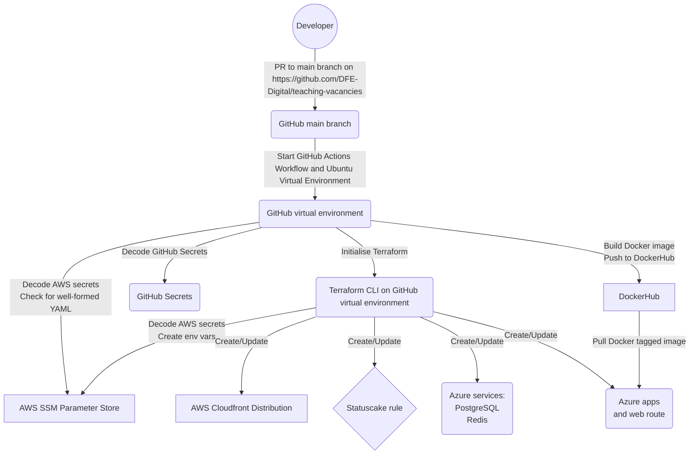
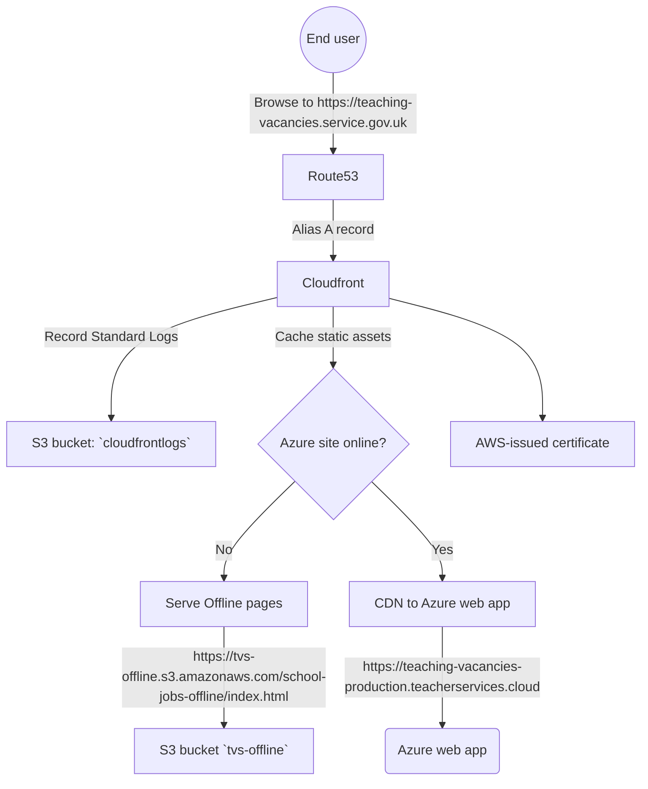

# Infrastructure diagrams

## CI/CD deployment pipeline

On Pull Request to `main` branch, GitHub Actions `deploy.yml` workflow launches:

## Web visit

## Mermaid.js

Diagrams generated with [Mermaid.js](https://mermaid-js.github.io/mermaid/#/)

Preview with [Markdown Preview Mermaid Support](https://marketplace.visualstudio.com/items?itemName=bierner.markdown-mermaid)

