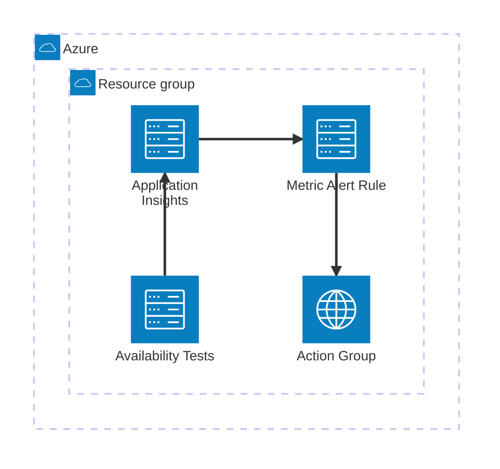
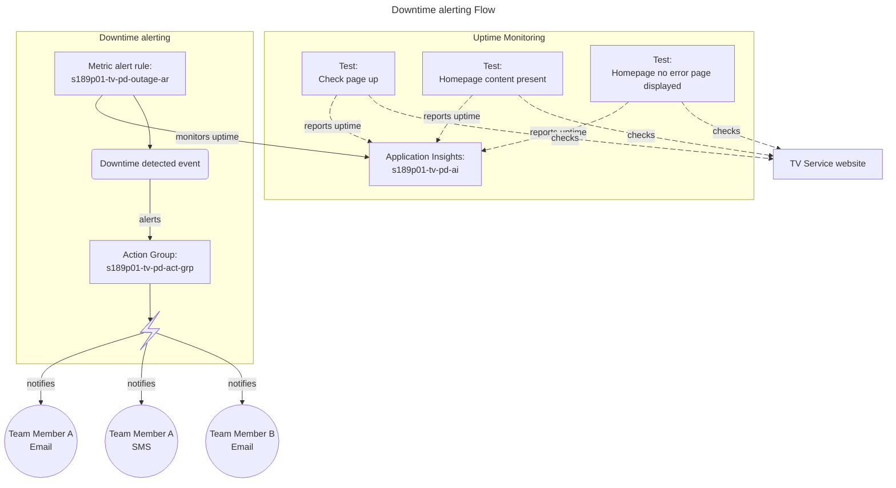

# Service Outages monitoring

We want to be aware ASAP of any outage causing our service to be unavailable for users.

In order to do so, we have set up tooling to regularly monitor our service website, identify any downtime, and alert
team members so they can follow-up with the appropriate actions.

## What to do in case of outage
If you receive a downtime/outage alert in your email or phone, first try to double check if the service is actually down and is not a false positive or transient blip.

You can check the service uptime through our tests in the "[What do we monitor](#what-do-we-monitor)" section of this document.

If the service is down:
  1. Notify our team in our Microsoft Teams chat.
  2. Follow the [Incident Playbook process](https://tech-docs.teacherservices.cloud/operating-a-service/incident-playbook.html#incident-playbook)
  3. Complement the above process with the [Teaching Vacancies service incident response plan](https://educationgovuk.sharepoint.com/:w:/r/sites/TeacherServices/Shared%20Documents/TWD%20-%20Teaching%20Vacancies/DfE%20Governance/TVS%20Business%20Continuity%20Impact%20Assessment.docx?d=w861d98cc3ebd4642bff01f921db452b3&csf=1&web=1&e=Yqr1YY)
     * [TV incident response plan contact tree](https://educationgovuk.sharepoint.com/:x:/r/sites/TeacherServices/Shared%20Documents/TWD%20-%20Teaching%20Vacancies/DfE%20Governance/TVS%20Incident%20Response%20Plan%20Contact%20Tree.xlsx?d=w2bddfcfe1753439ba864c1e27557aba6&csf=1&web=1&e=CHbrY7)
     * [TV incident log register](https://educationgovuk.sharepoint.com/:x:/r/sites/TeacherServices/Shared%20Documents/TWD%20-%20Teaching%20Vacancies/DfE%20Governance/TVS%20Incident%20Log.xlsx?d=w8eca3319a74344198b94b581d8f85fd2&csf=1&web=1&e=fIw2It)
  3. Try to identify & remediate the cause, following [monitoring](monitoring.md) and [alerting](alert-runbook.md) documentation.

## What do we monitor
We have 3 tests:
- The `/check` endpoint returns an HTTP `200` response code. [StatusCake](https://app.statuscake.com/UptimeStatus.php?tid=7501210), [Azure](https://portal.azure.com/#@platform.education.gov.uk/resource/subscriptions/3c033a0c-7a1c-4653-93cb-0f2a9f57a391/resourceGroups/s189p01-tv-pd-rg/providers/microsoft.insights/webtests/teaching%20vacancies%20check-s189p01-tv-pd-ai/availability)
- The homepage contains the `create a jobseeker account` string. [StatusCake](https://app.statuscake.com/UptimeStatus.php?tid=7501211), [Azure](https://portal.azure.com/#@platform.education.gov.uk/resource/subscriptions/3c033a0c-7a1c-4653-93cb-0f2a9f57a391/resourceGroups/s189p01-tv-pd-rg/providers/microsoft.insights/webtests/teaching%20vacancies%20-%20homepage%20string-s189p01-tv-pd-ai/availability)
- The homepage doesn't display a `500 Internal Server Error page`. [StatusCake](https://app.statuscake.com/UptimeStatus.php?tid=7501209), [Azure](https://portal.azure.com/#@platform.education.gov.uk/resource/subscriptions/3c033a0c-7a1c-4653-93cb-0f2a9f57a391/resourceGroups/s189p01-tv-pd-rg/providers/microsoft.insights/webtests/teaching%20vacancies%20-%20500%20error-s189p01-tv-pd-ai/availability)

## Our monitoring systems

We have historically used **StatusCake** for this purpose. But the shared account quota between DfE services caused some
issues with SMS not being sent during an outage.

We have incorporated the same uptime monitoring into **Azure**, as it is our current hosting provider and brings uptime
monitoring and alerting capabilities.

## Azure Uptime monitoring

### Architecture

The uptime monitoring through Azure is composed of the following components:

#### Resource Group: s189p01-tv-pd-rg
All the Teaching Vacancies Azure resources for the production environment belong within the [s189p01-tv-pd-rg](https://portal.azure.com/#@platform.education.gov.uk/resource/subscriptions/3c033a0c-7a1c-4653-93cb-0f2a9f57a391/resourceGroups/s189p01-tv-pd-rg/overview) resource group.
#### Application Insights: s189p01-tv-pd-ai
The app insights [s189p01-tv-pd-ai](https://portal.azure.com/#@platform.education.gov.uk/resource/subscriptions/3c033a0c-7a1c-4653-93cb-0f2a9f57a391/resourceGroups/s189p01-tv-pd-rg/providers/microsoft.insights/components/s189p01-tv-pd-ai/overview) allows you to view and create availability tests (Left Menu > 'Investigate' dropdown > 'Availability')

##### Availability tests
The tests ([check endpoint](https://portal.azure.com/#@platform.education.gov.uk/resource/subscriptions/3c033a0c-7a1c-4653-93cb-0f2a9f57a391/resourceGroups/s189p01-tv-pd-rg/providers/microsoft.insights/webtests/teaching%20vacancies%20check-s189p01-tv-pd-ai/availability), [homepage text](https://portal.azure.com/#@platform.education.gov.uk/resource/subscriptions/3c033a0c-7a1c-4653-93cb-0f2a9f57a391/resourceGroups/s189p01-tv-pd-rg/providers/microsoft.insights/webtests/teaching%20vacancies%20-%20homepage%20string-s189p01-tv-pd-ai/availability), [homepage no error](https://portal.azure.com/#@platform.education.gov.uk/resource/subscriptions/3c033a0c-7a1c-4653-93cb-0f2a9f57a391/resourceGroups/s189p01-tv-pd-rg/providers/microsoft.insights/webtests/teaching%20vacancies%20-%20500%20error-s189p01-tv-pd-ai/availability)) passing defines the uptime/availability graph in the Application Insights.

#### Metric alert rules: s189p01-tv-pd-outage-ar
The metric alert rule [s189p01-tv-pd-outage-ar](https://portal.azure.com/#@platform.education.gov.uk/resource/subscriptions/3c033a0c-7a1c-4653-93cb-0f2a9f57a391/resourceGroups/s189p01-tv-pd-rg/providers/microsoft.insights/metricalerts/s189p01-tv-pd-outage-ar/overview) monitors a metric for a resource and, based on defined conditions, triggers notifications to the members of an action group.

In our case, we monitor the [s189p01-tv-pd-ai](https://portal.azure.com/#@platform.education.gov.uk/resource/subscriptions/3c033a0c-7a1c-4653-93cb-0f2a9f57a391/resourceGroups/s189p01-tv-pd-rg/providers/microsoft.insights/components/s189p01-tv-pd-ai/overview)
resource availability, and trigger the alert if the service availability was less than 100% over the last 5 minutes.

#### Action Group: s189p01-tv-pd-act-grp
The [s189p01-tv-pd-act-grp](https://portal.azure.com/#@platform.education.gov.uk/resource/subscriptions/3c033a0c-7a1c-4653-93cb-0f2a9f57a391/resourceGroups/s189p01-tv-pd-rg/providers/microsoft.insights/actiongroups/s189p01-tv-pd-act-grp/overview) action group defines who/where will receive the notifications when an alert is triggered.
In our case we have a list of users that will receive an email and (some) SMS alerts.

### Flow

