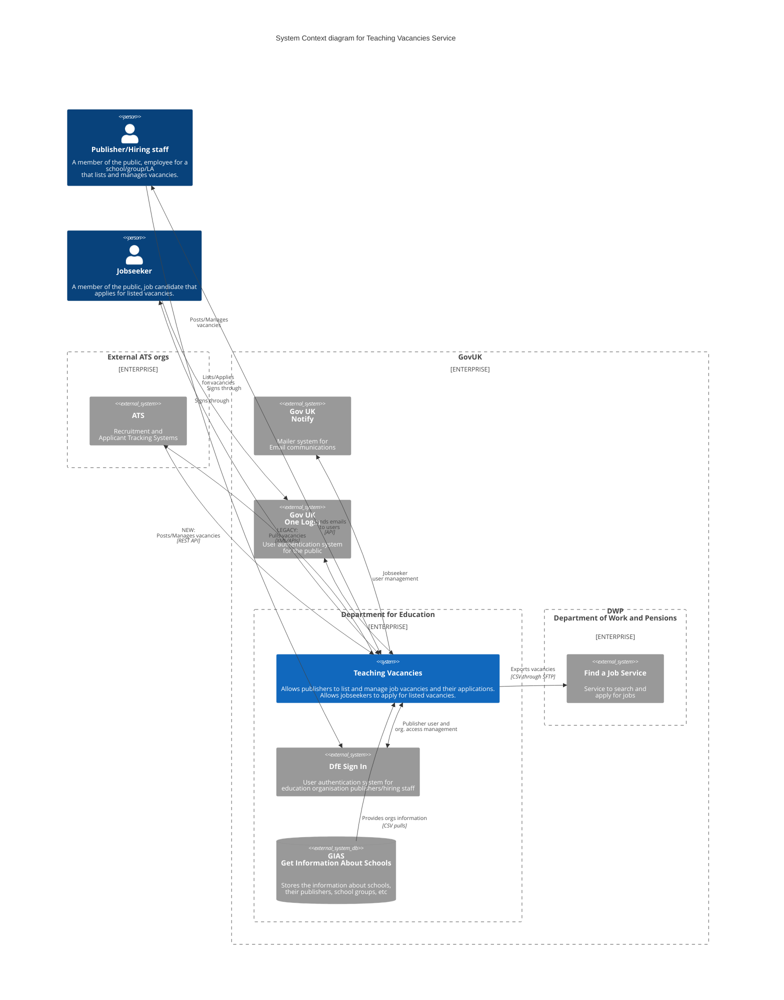

# Service Overview

> Teaching Vacancies is a free job-listing service from the Department for Education.
>
> Teachers can search and apply for jobs at schools or trusts in England, save jobs and set up job alerts.

## C4 System Context Diagram
How does Teaching Vacancies fall within GovUK and Department for Education scopes?

How does integrate with People and other software systems?

## Architecture Diagram
This diagram provides an overview of the Teaching Vacancies service, illustrating its core components, data flows, and integrations. It highlights the relationships between the web application, background workers, databases, external APIs, and third-party services involved in publishing, searching, and managing job vacancies.

```mermaid
---
icons:
    - name: logos
      url: https://unpkg.com/@iconify-json/logos@1/icons.json
---
architecture-beta
  %% Documentation reference: https://mermaid.js.org/syntax/architecture.html
  %% The layout for the Architecture diagram is achieved through junctions and edges.

  %% -------------------------------------------------------------------------
  %% Azure
  %% -------------------------------------------------------------------------

  %% The different groups and subgroups
  group azure(logos:microsoft-azure)[Azure Platform Identity]
  group azurerg(logos:microsoft-azure)[Azure Resource Group] in azure
  group azureredis(logos:redis)[Azure Cache for Redis] in azurerg
  group azuredb(logos:postgresql)[Azure DB for PostgreSQL flexible server] in azurerg

  %% Services are the 'leafs' living in eah group
  service db(logos:postgresql)[Backend DB] in azuredb
  service rediscache(logos:redis)[Cache] in azureredis
  service redisqueue(logos:redis)[Background Jobs Queue] in azureredis

  group azureks(logos:kubernetes)[Azure Kubernetes] in azure
  group web(logos:docker-icon)[Web] in azureks
  group worker(logos:docker-icon)[Worker] in azureks

  service rails(logos:rails)[Ruby on Rails pods] in web
  service workerpod(logos:sidekiq)[Sidekiq pods] in worker

  %% Azure services layout
  junction junctionAzure in azure
  junction junctionAzureRedis in azureredis
  junction junctionAzureResources in azurerg
  junction junctionAzureKubernetes in azure

  workerpod{group}:R -- L:junctionAzureKubernetes
  rails{group}:L -- R:junctionAzureKubernetes
  redisqueue:R -- L:junctionAzureRedis
  rediscache:L -- R:junctionAzureRedis

  junctionAzureResources:T -- B:junctionAzureRedis
  db{group}:L -- R:junctionAzureResources
  junctionAzureResources:B -- T:junctionAzureKubernetes

  %% -------------------------------------------------------------------------
  %% AWS
  %% -------------------------------------------------------------------------
  group aws(logos:aws)[AWS]
  service route53(logos:aws-route53)[Route 53] in aws
  service parameterstore(logos:aws-secrets-manager)[Parameter Store] in aws
  service s3(logos:aws-s3)[s3] in aws

  %% AWS services layout
  junction junctionAws in aws
  route53:T --> B:junctionAws
  s3:R <--> L:junctionAws
  parameterstore:L --> R:junctionAws

  %% -------------------------------------------------------------------------
  %% Google
  %% -------------------------------------------------------------------------
  group googlecloud(logos:google-cloud)[Google Cloud]
  service googledrive(logos:google-drive)[Drive] in googlecloud
  service bigquery(logos:google-analytics)[BigQuery] in googlecloud
  service geocoding(logos:google-maps)[Geocoding] in googlecloud
  service places(logos:google-maps)[Places] in googlecloud
  service recaptcha(logos:recaptcha)[Recaptcha] in googlecloud

  %% Google services Layout
  junction junctionGoogleBottom in googlecloud
  junction junctionGoogleTop in googlecloud
  junctionGoogleBottom:T -- B:junctionGoogleTop

  recaptcha:R -- L:junctionGoogleBottom
  bigquery:L <-- R:junctionGoogleBottom
  places:R --> L:junctionGoogleTop
  geocoding:L --> R:junctionGoogleTop
  googledrive:B <-- T:junctionGoogleTop

  %% -------------------------------------------------------------------------
  %% Monitoring services
  %% -------------------------------------------------------------------------
  group monitoring(cloud)[Monitoring Services]
  service sentry(logos:sentry)[Sentry error tracking] in monitoring
  service logit(logos:kibana)[Logit Kibana] in monitoring
  service zendesk(logos:zendesk)[Zendesk support] in monitoring
  service grafana(logos:grafana)[Grafana service namespace and pods dashboards] in monitoring
  service skylight(logos:skylight)[Skylight performance monitoring] in monitoring

  %% Monitoring services Layout
  junction junctionMonitoringTop in monitoring
  junction junctionMonitoringBottom in monitoring
  junctionMonitoringTop:B -- T:junctionMonitoringBottom

  logit:L <-- R:junctionMonitoringTop
  skylight:R <-- L:junctionMonitoringTop
  sentry:R <-- L:junctionMonitoringBottom
  zendesk:L <-- R:junctionMonitoringBottom
  grafana:T <-- B:junctionMonitoringBottom


  %% -------------------------------------------------------------------------
  %% GovUK services
  %% -------------------------------------------------------------------------
  group govuk(cloud)[Gov UK]
  group dfe(cloud)[DfE] in govuk
  service dfesignin(server)[DfE Sign in] in dfe
  service gias(server)[DfE Gias] in dfe
  service govukonelogin(server)[GovUK One Login] in govuk
  service govuknotify(server)[GovUK Notify] in govuk
  service dwpfindajob(server)[DWP Find a Job] in govuk
  service onspolygonsapi(server)[ONS Polygons Apis] in govuk

  %% GovUK services layout
  junction junctionGovukTop in govuk
  junction junctionGovukBottom in govuk
  junction junctionDfe in dfe
  dfesignin:L -- R:junctionDfe
  gias:R --> L:junctionDfe

  junctionDfe:B -- T:junctionGovukTop
  junctionGovukBottom:T -- B:junctionGovukTop
  govukonelogin:L -- R:junctionGovukTop
  govuknotify:R <-- L:junctionGovukTop
  dwpfindajob:R <-- L:junctionGovukBottom
  onspolygonsapi:L --> R:junctionGovukBottom

  %% -------------------------------------------------------------------------
  %% ATS external providers
  %% -------------------------------------------------------------------------
  group ats(internet)[ATS providers]
  service atsfeeds(internet)[ATS Feeds Legacy] in ats
  service atsclients(internet)[ATS Clients] in ats

  junction junctionAts in ats
  atsfeeds:R --> L:junctionAts
  atsclients:L --> R:junctionAts

  %% -------------------------------------------------------------------------
  %% Connections between different areas/clouds
  %% -------------------------------------------------------------------------
  junction junctionLeft
  junction junctionCenter
  junction junctionRight
  %% All these extra junctions is to force the diagram extending right to spread the groups so they don't pile up.
  junction junctionRight2
  junction junctionRight3
  junction junctionRight4
  junction junctionRight5

  rails{group}:B <-- T:junctionAts
  rails{group}:R -- L:junctionLeft
  junctionLeft:R -- L:junctionCenter
  junctionCenter:R -- L:junctionRight
  junctionRight:R -- L:junctionRight2
  junctionRight2:R -- L:junctionRight3
  junctionRight3:R -- L:junctionRight4
  junctionRight4:R -- L:junctionRight5

  junctionGovukBottom:B -- T:junctionCenter
  junctionAws:T -- B:junctionCenter
  junctionMonitoringTop:T <-- B:junctionRight5
  junctionGoogleBottom:B -- T:junctionRight5

```

