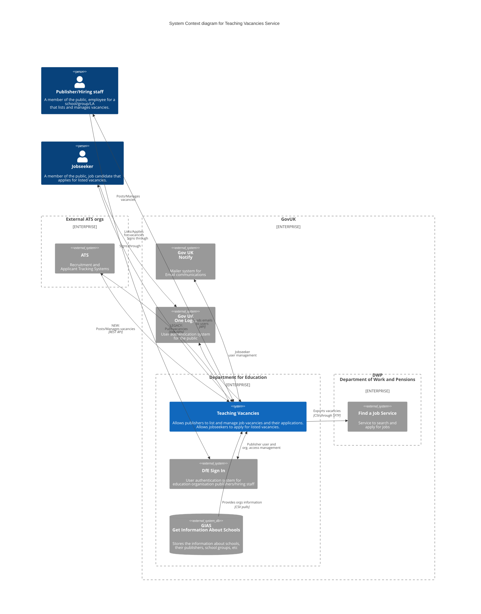

# Service Overview

> Teaching Vacancies is a free job-listing service from the Department for Education.
>
> Teachers can search and apply for jobs at schools or trusts in England, save jobs and set up job alerts.

## C4 System Context Diagram
How does Teaching Vacancies fall within GovUK and Department for Education scopes?

How does integrate with People and other software systems?

