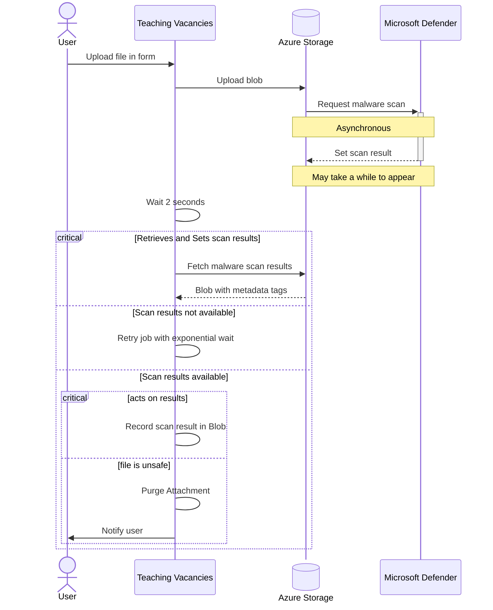
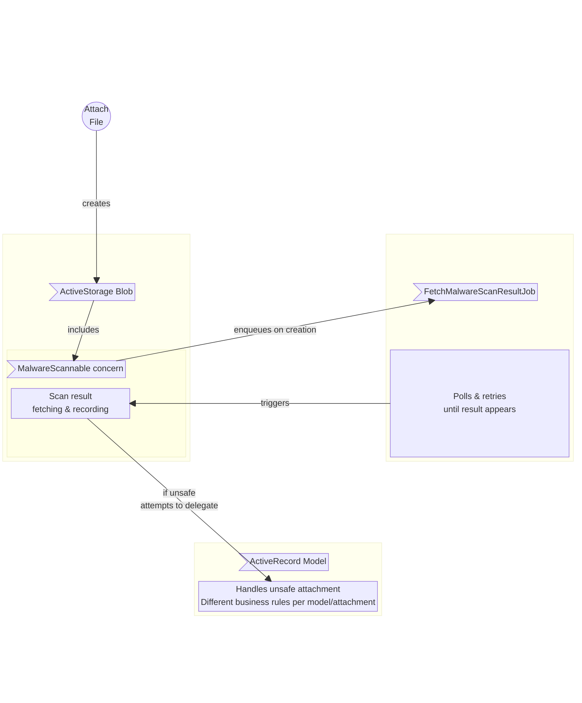

# File uploads antivirus scan

We use "Microsoft Defender for Cloud" to scan malware and viruses in the service file uploads.

This happens asynchronously in Azure Storage and is configured at Azure Storage account level.

## Antivirus process for file uploads

## Antivirus check process in our codebase

Based on the output of the AV scan result, `process_malware_scan_result!` on the blob records the state and delegates to each owning record's `handle_unsafe_attachment` method. This is where attachments are purged, resources destroyed, and notifications sent. Each model that owns scannable attachments defines its own handler; records without one are silently skipped.

Also user journeys will check/validate that the attachments are AV clean before allowing users to proceed/submit.
