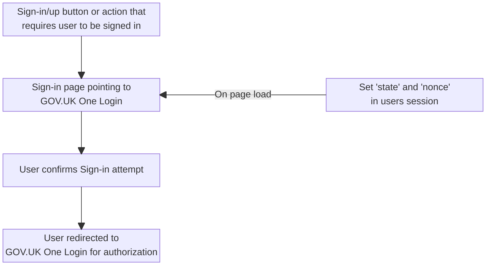
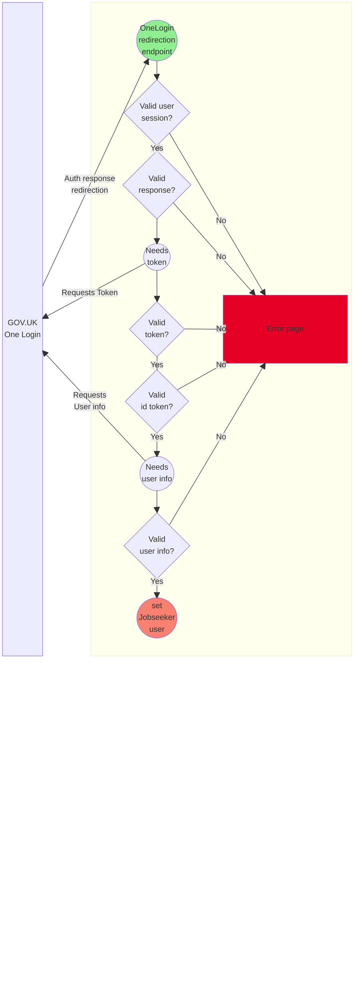
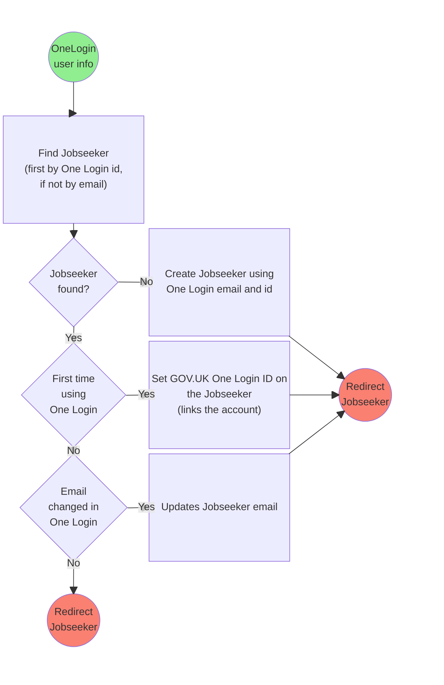

# Jobseekers Authentication

Jobseekers authenticate via the [GOV.UK One Login](https://www.sign-in.service.gov.uk/) service.

For detailed information, check the GOV.UK One Login [tech documentation](https://tech-docs.account.gov.uk/)

## GOV.UK One Login configuration

### Environments

Different environments talk to different GOV.UK One Login environments:

- Local development -> Integration GOV.UK One Login
- QA -> Integration GOV.UK One Login
- Staging -> Integration GOV.UK One Login
- Production -> Production Integration GOV.UK One Login

- Review Apps:
  Due to the ephemereal nature of these environments, they cannot be automatically configured to connect with GOV.UK One Login.
  They use a magic link sent via email to authenticate.

### Configuring GOV.UK One Login environments

#### Integration
The GOV.UK One Login integration environment can be managed through their admin tool account ([registration](https://admin.sign-in.service.gov.uk/register/enter-email-address) and [access](https://admin.sign-in.service.gov.uk/)).

**Limitation**: the integration environment account can only belong to a single user who set it up. To change it, a different
developer needs to set it up froms scratch with their own account or ask for support request so the configuration can be requested/transfered.

#### Production

**At the moment, there is no admin portal where we can configure the production integration at**.
The production environment is set up by their technical team and managed through support requests.

### Support
The GOV.UK OneLogin team has [Slack channel](https://ukgovernmentdigital.slack.com/archives/C02AQUJ6WTC):
- You will need to create an account in UK Government Digital( `ukgovernmentdigital.slack.com` ) using your `@education.gov.uk` email address)
- Their channel within the space is `#govuk-one-login`.
- Alternative there is a [contact form](https://www.sign-in.service.gov.uk/support).

For support, we will need to provide the Client ID we need help with.

### Set environment variables

Each environment will need these values to be set on AWS Parameter Store secrets under `/teaching-vacancies/*env*/app/secrets`.

```
RAILS_MASTER_KEY=
GOVUK_ONE_LOGIN_CLIENT_ID=
GOVUK_ONE_LOGIN_BASE_URL=
```

### Secrets containing GOV.UK One Login public/private keys

The Rails master key is used to automatically read the Rails Secrets encrypted file: `config/secrets.yml.enc`, following the
[Rails custom credentials guidance](https://edgeguides.rubyonrails.org/security.html#custom-credentials).

The credentials file contains the `one_login.public_key` and `one_login.private_key` values, needed for each GOV.UK One Login
integration configuration.


- To access/edit this file, run `bin/rails credentials:edit`.
- To access the credentials within the app: `Rails.application.credentials.one_login.private_key`

## GOV.UK One Login contingency fallback playbook

### Background

This is a contingency plan for when GOV.UK One Login has an outage. The fallback authentication method relies on the email address we have stored in DB for the Jobseekers.

It replaces the GOV.UK One Login sign in method with one whereby the user is prompted to enter their email address, and clicks a unique login link. This login link works only once and expires after a configurable time.

### How to use

Here are the steps to follow to use our contingency fallback sign-in method.

First, decide whether to switch on the fallback authentication. This call should be made by the Product Owner/Manager if they are available.

### Toggle Authentication Fallback

- Switch on the fallback authentication by setting the environment variable `AUTHENTICATION_FALLBACK_FOR_JOBSEEKERS` to `true`.
- Switch off the fallback authentication by setting the environment variable `AUTHENTICATION_FALLBACK_FOR_JOBSEEKERS` to `false`.

#### Toggling Authentication Fallback Using an automated deployment

Changing the environment variable within the `<env>_app_env.yml` follows the standard deployment procedure, and allows deployments to production to continue:
- create a feature branch
- edit the file [terraform/workspace-variables/production_app_env.yml](/terraform/workspace-variables/production_app_env.yml)
- set the environment variable `AUTHENTICATION_FALLBACK_FOR_JOBSEEKERS` to `true` or `false` as required
- create a Pull Request
- merge after approval

#### Toggling Authentication Fallback Using manual steps

The following method is included for completeness, but should be considered as a "panic mode" option only.
It requires `SpaceDeveloper` permission on the `s189-teacher-services-cloud-production` subscription, and only persists until the next [Automated Deployment to staging and production](/documentation/operations/deployment/deployments.md#build-and-deploy-to-staging-and-production---github-actions)

- Block all deployments to `production` by requesting in the Slack channel `#tv_devs`
- Log in in the [Azure Portal](https://portal.azure.com.mcas.ms/) and request access to the `s189-Contributor and Key Vault editor` role in the `s189-teacher-services-cloud-production` subscription.
- Once having the access granted by one of the managers, login into Azure from the console:
  ```bash
  az login --tenant 9c7d9dd3-840c-4b3f-818e-552865082e16
  ```
- Get the credentials for the production cluster:
  ```bash
  make production get-cluster-credentials CONFIRM_PRODUCTION=YES
  ```
- Get the current environment value:
  ```bash
  kubectl -n tv-production exec deployment/teaching-vacancies-production -- env | grep AUTHENTICATION_FALLBACK_FOR_JOBSEEKERS
  ```
- Get current environment variable value over one of the listed pods:


- Update the environment variable with the [set env](https://kubernetes.io/docs/reference/generated/kubectl/kubectl-commands#-em-env-em-) command
- Enable the fallback with:
  ```bash
  kubectl -n tv-production set env deployment/teaching-vacancies-production AUTHENTICATION_FALLBACK_FOR_JOBSEEKERS=true
  ```

- Wait for a bit until the pods get automatically restarted with the new value. Check that the value changed:
  ```bash
  kubectl -n tv-production exec deployment/teaching-vacancies-production -- env | grep AUTHENTICATION_FALLBACK_FOR_JOBSEEKERS
  ```

- When not needed anymore disable the fallback with:
  ```bash
  kubectl  -n tv-production set env  deployment/teaching-vacancies-production AUTHENTICATION_FALLBACK_FOR_JOBSEEKERS=false
  ```

## GOV.UK One Login flow

The basic flow for a Jobseeker using our service is as follows:

1. When a jobseeker needs to sign-in/sign-up, they get sent to a Teaching Vacancies sign-in page pointing to GOV.UK One Login.
2. After confirmation, they get redirected to the GOV.UK One Login service.
3. On GOV.UK One Login the jobseeker either:
    - register a new account.
    - sign-in with their existing One Login account.
4. After a successfull sign-in, they get redirected back to Teaching Vacancies.
5. Teaching Vacancies matches/creates the internal Jobseeker associated with the GOV.UK One Login account, and signs-in the Jobseeker session.


The detailed flow of requests/responses between Teaching Vacancies and GOV.UK One Login can be found in the [tech documentation](https://tech-docs.account.gov.uk/how-gov-uk-one-login-works/#understand-the-flow-gov-uk-one-login-uses)

## Implementation in Teaching Vacancies

The Jobseeker session is still managed by Devise gem.

Teaching Vacancies configures OneLogin as an Omniauth provider through the [Devise Omniauth configuration](/config/initializers/omniauth.rb).

There are a few paths in our service related with GOV.UK One Login:
- `/jobseekers/sign-in` --> Bridge page in our service that, upon confirmation, sends the non-signed jobseeker to sign through GOV.UK One Login.
- `/jobseekers/auth/govuk_one_login/callback` --> GOV.UK One Login redirects jobseekers back to this path after signing-up/in through their service. All the heavy lifting in our side is done here.
- `/jobseekers/sign_out` --> Signs the jobseeker out from our service. GOV.UK One Login redirects jobseekers back to this path after signing users out in their service.

### How do we map the GOV.UK One Login user with our service jobseekers

When a successfully authenticated GOV.UK One Login user gets redirected back to our service. This user information contains:
- The user id in GOV.UK One Login
- The email address for this user in GOV.UK One Login

With this information, Teaching Vacancies will match/create/update a Jobseeker account within our service, and sign them in.

## The flow
The Jobseeker sign-up/in flow can we break these phases:
1. User gets sent to GOV.UK One Login for authentication.
2. Validate and get user info from the GOV.UK One Login response.
3. Set the Teaching Vacancies Jobseeker user.
4. User gets redirected to the right page in Teaching Vacancies.

The 3 first phases flows are as follows:

### 1. User gets sent to GOV.UK One Login for authentication


### 2. Validate and get user info from the GOV.UK One Login response

### 3. Set the Teaching Vacancies Jobseeker user


